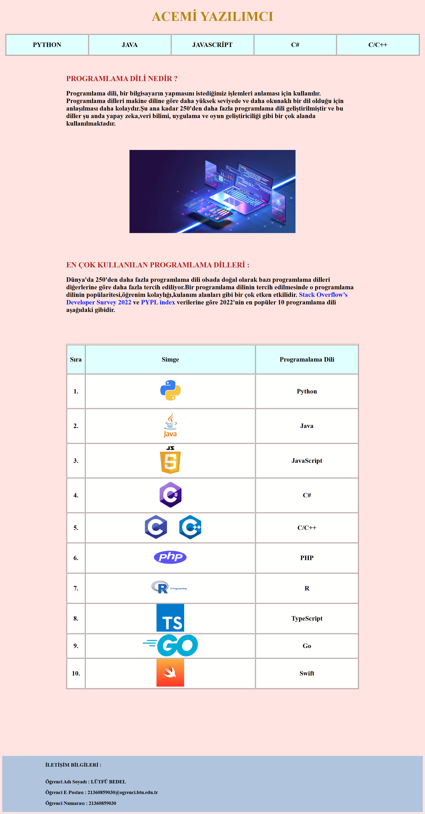

# HTML_AcemiYazilimci

Bu proje, programlama dünyasına yeni adım atan geliştiricilere temel seviyede rehberlik etmek amacıyla hazırlanmıştır. Depo içerisinde, popüler programlama dillerine dair temel bilgiler sunan HTML dosyaları bulunmaktadır. Proje, eğitim amaçlıdır ve yeni başlayanların yazılım dünyasına hızlı bir giriş yapmasını hedeflemektedir.

## İçindekiler

- [Proje Hakkında](#proje-hakkında)
- [İçerik](#içerik)
- [Görseller](#resimler)
- [Lisans](#lisans)

## Proje Hakkında

**HTML_AcemiYazilimci**, temel programlama dillerini tanıtmak ve bu dillere dair kısa ve öz bilgileri bir araya getirmek amacıyla oluşturulmuştur. Depo, tamamen HTML tabanlı bir yapı kullanılarak geliştirilmiştir. Amacımız, yeni başlayanların öğrenim sürecini kolaylaştırmaktır.

### Amaçlar

- Programlama dillerine hızlı ve kolay bir giriş sağlamak
- Yeni başlayanların bilgiye erişimini kolaylaştırmak
- Basit HTML tabanlı bir proje örneği sunmak

## İçerik

Proje aşağıdaki dosyalardan ve içeriklerden oluşmaktadır:

| Dosya Adı       | Açıklama                                      |
|------------------|----------------------------------------------|
| `index.html`     | Ana sayfa, tüm dillerin listelendiği bağlantılar içerir. |
| `C.html`         | C programlama dili hakkında temel bilgiler.  |
| `Csharp.html`    | C# programlama dili hakkında temel bilgiler. |
| `Java.html`      | Java programlama dili hakkında temel bilgiler. |
| `JavaScript.html`| JavaScript dili hakkında temel bilgiler.     |
| `Python.html`    | Python dili hakkında temel bilgiler.         |

## Website

## Lisans

Bu proje, [MIT Lisansı](LICENSE) kapsamında lisanslanmıştır. Daha fazla bilgi için `LICENSE` dosyasına göz atabilirsiniz.
